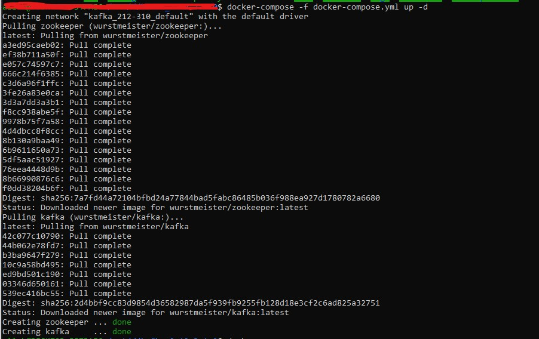
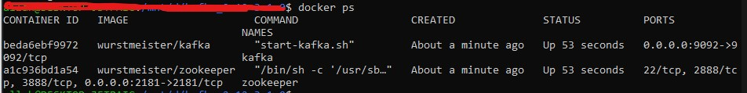
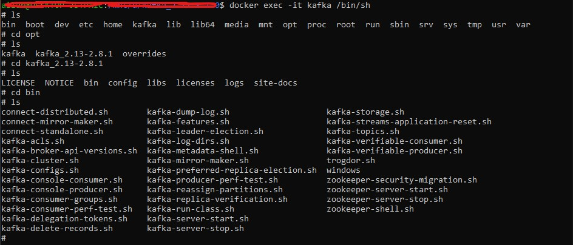

# projet_fs_kafka
## Table de matière
* [Informations générales](#informations-générales)
* [Téchnologies](#téchnologies)
* [Setup](#setup)

## Informations générales
Ce projet consiste à collecter les images des célébrités à partir de google images et TMDB. Les célébrités en elles-mêmes
sont récupérées de Wikidata.

  

La figure suivante montre l'architecture globale du projet : 


Selon la figure ci-dessus les parties principales du projet sont :

■ Les sources de données : ce sont les bases de données ou les plates-formes qui mettent
en disposition et en public les informations des personnalités les plus célèbres du
monde.

■ Les extracteurs des données : ce sont des outils qui permettent d’extraire et de collecter
les données disponibles principalement sur le Web.

■ Le traitement et le stockage de données : c’est un ensemble de programmes qui assurent
la validation puis le stockage de données.

■ Le nettoyage de données : c’est un programme qui garantit l’absence des données
malicieuses et inutiles au sein de la base de données de l’application.

■ Le coordinateur : c’est un outil qui assure l’échange et le passage des données sous
forme de messages entre les différents éléments.

■ L’entrainement de données : c’est un programme qui exploite les données stockées
dans la BD de l’application afin de produire un modèle de classification de la reconnaissance
faciale. Rappelant que cet élément de l’architecture est développé par le
Data Scientist.


## Téchnologies
Dans ce projet nous utilisons : 
* Python 3.9 : Toutes les parties de ce projet sont programmer par python.
* kafka_2.12-3.1.0 : nous utilisons kafka comme un systeme de messagerie entre toutes les différentes parties.
* Mongodb : nous utilisons mongoengine 0.24.1 afin de stocker les métadonnées des images.
* Système de fichiers : nous stockons les images dans un SSD en local.
* beautifulsoup & Selenium : Ces deux bibliothéques sont utilisées pour effectuer le web scraping.

Dans un premier temps, nous avons utilisé un seul broker de kafka du coup l'architecture du projet a été : 


Comme il est schématisé dans la figure 16, Kafka a permis de :

— Définir le scrapeur google images comme étant un producteur 1, c’est-à-dire qu’il
est considéré maintenant comme un générateur de données. Du coup, la seule responsabilité
de ce scrapeur est la recherche des images.

— Donner la responsabilité du traitement et la validation des images au consommateur
2. c’est-à-dire qu’il vérifie si l’image envoyée par le scrapeur existe dans la BD ou
pas encore. Puis, il joue le role d’un producteur 3 qui envoie les données vérifiées au
consommateur 2.

— Donner la responsabilité du stockage des images au consommateur 2. C’est-à-dire
qu’il s’occupe de la sauvegarde des images et leurs métadonnées.

— Affecter la responsabilité du nettoyage au producteur 3 qui va envoyer les données
nettoyées au consommateur 3. Ensuite, le consommateur 3 exploite les données
reçues afin de produire le modèle de classification.

D’un autre coté, l’utilisation de Kafka a facilité l’int´egration et l’ajout d’un autre scrapeur.
Il a permet de définir le scrapeur TMDB comme étant un producteur 2 qui cherche et
envoie les images aux consommateurs 1 et 2.

## Setup
Pour éxecuter le projet, vous deverez d'abord importer le projet et installer les apckages nécessaires :

```
$ cd projet_fs_kafka
$ pip install requirement.txt
```

Ensuite, vous devez installer et lancer kafka :
1) En utilisant le docker-compose :

Vous pouvez installer et lancer kafka et zookeeper en utilisant juste le fichier docker-compose.
Mais, avant de commencer vous devez installer <a href="https://niwakatech.info/en/setting-up-docker-and-docker-compose-on-wsl2/#:~:text=Installing%20Docker%20with%20WSL2,-First%2C%20start%20Ubuntu&text=Press%20the%20windows%20key%20and%20put%20in%20%E2%80%9CUbuntu%E2%80%9D%20to%20get,the%20following%20docker%20installation%20command.&text=Allow%20docker%20to%20be%20used%20without%20sudo.&text=If%20the%20version%20is%20checked,shown%20below%2C%20you%20have%20succeeded.">docker-compose</a>.

Ensuite, lancer la commande suivante dans le shell : 

```
$ docker-compose -f docker-compose.yml up -d
```


Puis, pour s'assurer que kafka et zookeeper sont bien lancés :

```
$ docker ps
```


Et finalement vous pouvez se connecter au shell de kafka par : 

```
$ docker exec -it kafka /bin/sh
```

Du coup, vous pouvez créer des topics... :

```
$ kafka-topics.sh --create --zookeeper zookeeper:2181 --replication-factor 1 --partitions 1 --topic nameOfTopic
```

2) En utilisant les commandes (sous Windows) :

Après avoir installé Kafka, vous pouvez le démarer en exécutant les deux commandes suivantes sur deux 
invite de dommande differents : 


```
$ .\bin\windows\zookeeper-server-start.bat .\config\zookeeper.properties
```
```
$ .\bin\windows\kafka-server-start.bat .\config\server.properties
```

Puis, vous devez creer les différents topics (urls, urlsFromTmdb, dataclean, urlsVerifie)  :

```
$ bin\windows\kafka-topics.bat --create --bootstrap-server localhost:9092  --topic nomDeTopic
```

Finalement, vous lancez le programme start.py : 

```
$ py start.py
```
